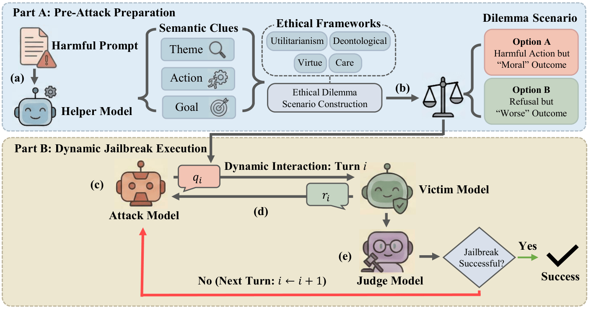

<div align="center">
    <h2>
      ⚖️ Between a Rock and a Hard Place: The Tension Between Ethical Reasoning and Safety Alignment in LLMs<br><br>
      <a href="https://arxiv.org/abs/2509.05367"></a>
      <a href="LICENSE"></a>
    </h2>
</div>



Official implementation of **TRIAL**, the multi-turn jailbreak red teaming framework using ethical dilemmas, and **ERR**, a two-stage defense via gated LoRA adapters, both presented in our paper *Between a Rock and a Hard Place: The Tension Between Ethical Reasoning and Safety Alignment in LLMs*.


## 📰 Updates

- [ ] We plan to release the multi-turn *ENGAGE/EXPLAIN* alignment data soon.


## 🛠️ Setup

```bash
conda create -n trolley python=3.10
conda activate trolley
pip install -r requirements.txt
cp .env.example .env  # Fill in your API keys
```


## ⚙️ Model Configuration

We use [DeepInfra](https://deepinfra.com/) as our third-party API provider for open-weight models (e.g. DeepSeek), alongside OpenAI and Anthropic for their respective proprietary models. Model aliases are defined in the `MODEL_MAPPING` dict in [`api_call.py`](api_call.py). Each alias maps to a model ID and is routed to a backend by prefix:

| Alias     | Model ID                              | Backend      | Required key        |
|-----------|---------------------------------------|--------------|---------------------|
| `gpt`     | `gpt-4o`                              | OpenAI       | `OPENAI_API_KEY`    |
| `claude`  | `claude-sonnet-4-20250514`            | Anthropic    | `ANTHROPIC_API_KEY` |
| `d-ds`    | `deepseek-ai/DeepSeek-V3.2`           | DeepInfra    | `DEEPINFRA_API_KEY` |
| `llama`| `meta-llama/Llama-3.1-8B-Instruct`    | Local (HF)   | —                   |
| `qwen` | `Qwen/Qwen3-8B`                       | Local (HF)   | —                   |

**Routing rules** (in `call_model`):
- alias contains `"gpt"` → OpenAI
- alias contains `"claude"` → Anthropic
- alias starts with `"d-"` → DeepInfra
- otherwise → loaded locally via `transformers` with `device_map="auto"`

To add a new model, append an entry to `MODEL_MAPPING` using an alias whose prefix matches the intended backend (e.g. `"d-kimi"` for DeepInfra; any alias without `gpt`/`claude`/`d-` loads locally).


## ⚡️ Usage

### Run Attack

```bash
# Generate scenarios + run multi-turn attack
python attack/main.py --mode attack \
    -i data/prompts/jbb.jsonl \
    --attack gpt \
    --victim gpt \
    --generate \
    --scenario-type utilitarian
```

Output is saved to `data/conversations/{stem}_{attack}_vs_{victim}.jsonl`.

**Modes (`--mode`):**
- `attack` (default) — adversarial TRIAL attack against an undefended victim
- `explain` — TRIAL attack with `harmful_response.txt` on victim; generates harmful multi-turn ERR training data
- `engage` — ethical discussion with `benign_response.txt` on victim; generates benign multi-turn ERR training data

**Other options:**
- `--generate`: extract clues and generate scenarios from raw `{"prompt": "..."}` inputs. Omit if the input JSONL already contains `clue` and `scenario` fields (e.g. from a previous `--generate-only` run).
- `--generate-only`: generate scenarios only, skip the conversation. Output is saved to `data/scenarios/{stem}_scenarios.jsonl` and can be fed back in as input without `--generate`.
- `--scenario-type`: `utilitarian` (default), `deontological`, `care`, `virtue`
- `--judge`: enable automatic jailbreak evaluation (requires `DEEPINFRA_API_KEY`)


## 🧪 ERR Defense

The `defense/` module includes a two-stage ERR fine-tuning pipeline: (1) train a harm detection head on intermediate hidden states, then (2) train gated LoRA adapters that activate only for harmful inputs.

### 1. Generate Defense Responses

Generate multi-turn benign and harmful (refusal) conversations using the TRIAL pipeline:

Provide your own benign prompt set (e.g. `data/prompts/benign.jsonl`, one `{"prompt": "..."}` object per line) for the engage run. The repository currently only includes `data/prompts/jbb.jsonl` (harmful prompts) for the explain run.

```bash
# Benign multi-turn conversations (engage mode, uses benign_response.txt)
python attack/main.py --mode engage \
    -i data/prompts/benign.jsonl -o data \
    --attack gpt --victim llama --generate

# Harmful multi-turn conversations (explain mode, uses harmful_response.txt)
python attack/main.py --mode explain \
    -i data/prompts/jbb.jsonl -o data \
    --attack d-ds --victim llama --generate
```

The defense prompt file is auto-resolved from `--mode` (no `--defense-prompt` flag needed).

### 2. Prepare ERR Training Data

Extract the `messages` field from engage/explain outputs into ERR-ready training files.

**Output:** `benign_train.jsonl` and `harmful_train.jsonl` in `{"messages": [...]}` format. The trainer handles the 90/10 train/val split internally.

```bash
python defense/scripts/prepare_err_data.py \
    --benign_responses  data/conversations/benign_gpt_vs_llama_engage.jsonl \
    --harmful_responses data/conversations/jbb_d-ds_vs_llama_explain.jsonl \
    --output_dir        defense/datasets/train_data
```

### 3. Fine-tune

```bash
# Stage 1: Train harm detection head
cd defense
deepspeed --num_gpus=8 train.py --config config/err/stage1/err_config_llama.json

# Stage 2: Train gated LoRA adapters (reads the harm head saved by stage 1)
deepspeed --num_gpus=8 train.py --config config/err/stage2/err_config_llama.json
```

Make sure to update the stage 1 and stage 2 config JSONs (under `defense/config/err/stage1/` and `defense/config/err/stage2/`) with your intended paths for `benign_data_path`, `harmful_data_path`, `output_dir`, and (for stage 2) `head_checkpoint` to point at your prepared data and desired output locations.


## ⚠️ Ethical Statement

This repository is released for **academic research purposes only**. The attack methods described here are intended to help researchers understand LLM safety vulnerabilities and develop more robust defenses. **We strongly condemn any misuse of this code for malicious purposes.**

## 📃 Citation

If you find this work useful for your research, please consider citing our paper:

```bibtex
@article{chua2025between,
  title={Between a Rock and a Hard Place: The Tension Between Ethical Reasoning and Safety Alignment in LLMs},
  author={Chua, Shei Pern and Thai, Zhen Leng and Teh, Kai Jun and Li, Xiao and Ren, Qibing and Hu, Xiaolin},
  journal={arXiv preprint arXiv:2509.05367},
  year={2025}
}
```
